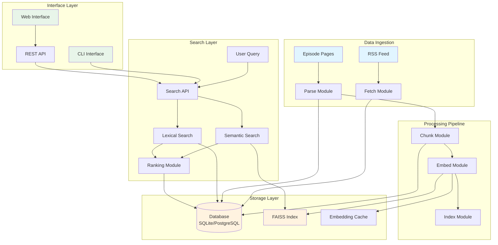
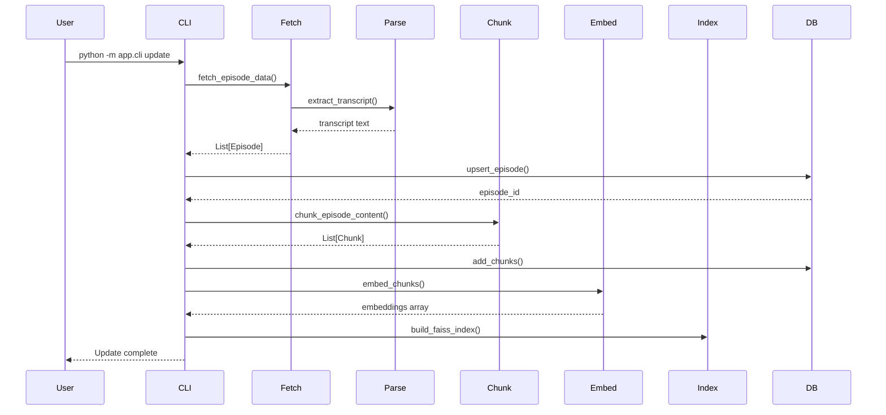
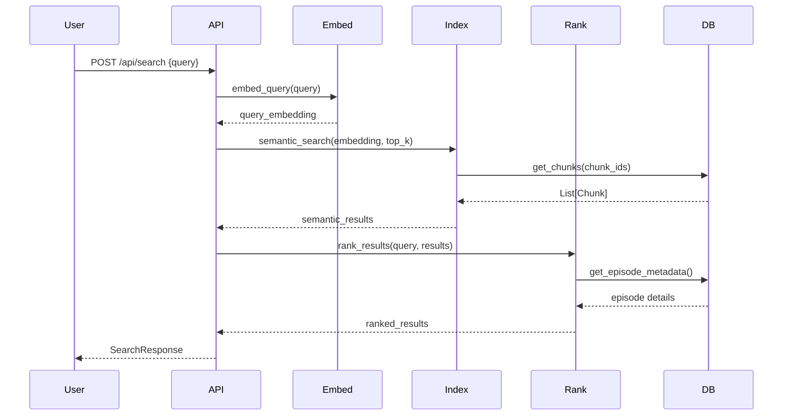
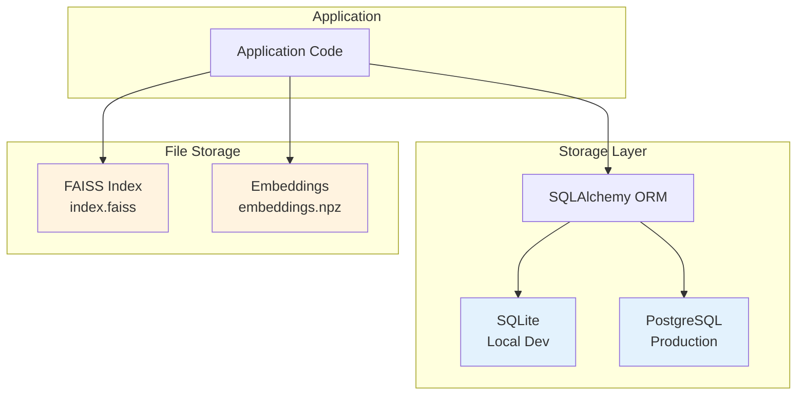
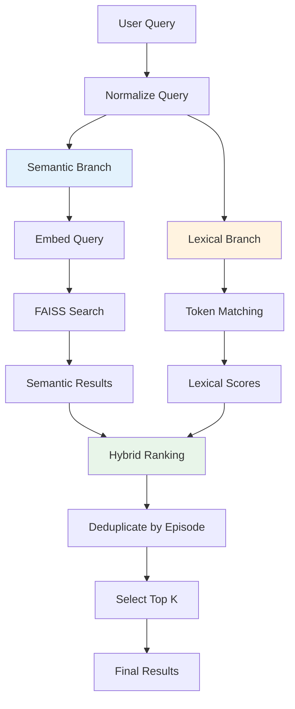
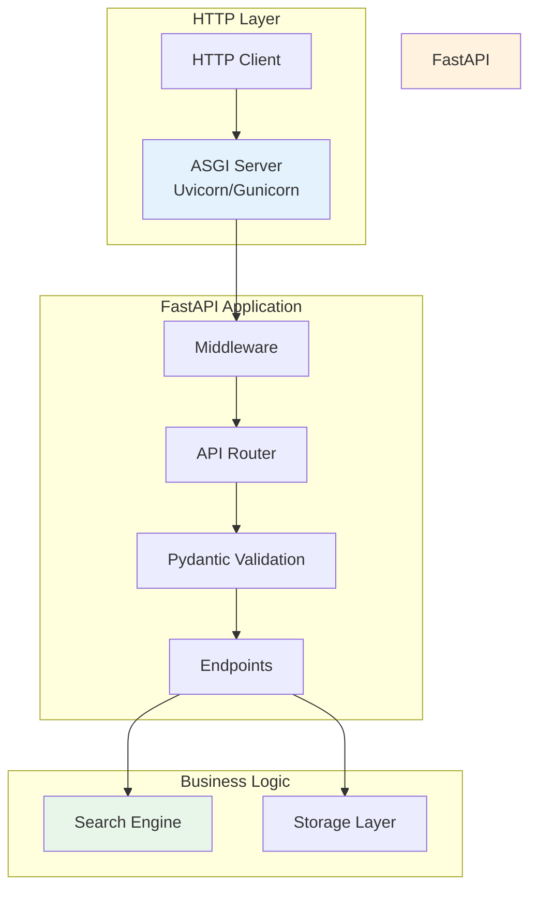
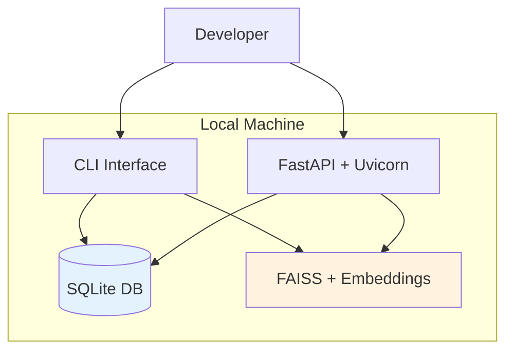
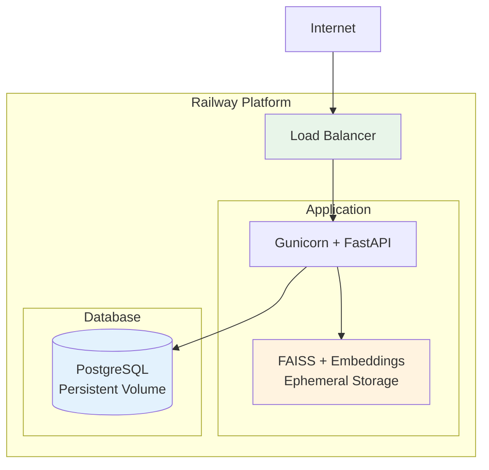

# System Architecture

This document describes the technical architecture of the Extraordinary Universe Search system — a production-grade semantic search engine for podcast content.

---

## Table of Contents

- [Overview](#overview)
- [High-Level Architecture](#high-level-architecture)
- [Core Components](#core-components)
- [Data Flow](#data-flow)
- [Storage Architecture](#storage-architecture)
- [Search Architecture](#search-architecture)
- [API Architecture](#api-architecture)
- [Deployment Architecture](#deployment-architecture)
- [Performance Considerations](#performance-considerations)
- [Design Decisions](#design-decisions)

---

## Overview

The system implements a **hybrid semantic search engine** that combines:

1. **Vector Search**: Dense embeddings for semantic understanding
2. **Lexical Search**: Keyword-based matching for precision
3. **Hybrid Ranking**: Weighted combination of both approaches

### Key Design Principles

- **Modularity**: Clear separation of concerns
- **Testability**: Each component is independently testable
- **Scalability**: Efficient indexing and search at scale
- **Maintainability**: Clean abstractions and documented interfaces
- **Operational Excellence**: Monitoring, health checks, graceful degradation

---

## High-Level Architecture



---

## Core Components

### 1. Fetch Module (`fetch.py`)

**Purpose**: Retrieve episode data from RSS feed and individual episode pages.

**Responsibilities**:
- Parse RSS feed for episode metadata
- Fetch HTML content for each episode
- Handle rate limiting and retries
- User-agent management

**Key Functions**:
```python
fetch_episode_data() -> List[Episode]
```

**Dependencies**:
- `requests`: HTTP client
- `xml.etree.ElementTree`: RSS parsing

**Error Handling**:
- Network errors: Retry with exponential backoff
- Parse errors: Log and continue with next episode
- Missing data: Use fallback values

---

### 2. Parse Module (`parse.py`)

**Purpose**: Extract transcript content from episode HTML pages.

**Responsibilities**:
- Locate transcript sections in HTML
- Clean and normalize text
- Handle multiple HTML structures
- Extract metadata

**Key Functions**:
```python
extract_transcript(html: str) -> str
parse_episode_page(html: str) -> Dict[str, str]
```

**Dependencies**:
- `beautifulsoup4`: HTML parsing
- `lxml`: Fast XML/HTML processing

**Algorithm**:
1. Parse HTML with BeautifulSoup
2. Search for transcript containers (multiple selectors)
3. Extract text while preserving paragraph structure
4. Clean whitespace and formatting
5. Return normalized transcript

---

### 3. Chunk Module (`chunk.py`)

**Purpose**: Split episode content into searchable chunks with context preservation.

**Responsibilities**:
- Segment text into fixed-size chunks
- Implement sliding window with overlap
- Preserve semantic boundaries (sentences/paragraphs)
- Track chunk positions

**Key Functions**:
```python
chunk_episode_content(
    episode_id: int,
    title: str,
    description: str,
    transcript: str
) -> List[Chunk]
```

**Algorithm**:
```
Input: Full episode text, chunk_size=1200, overlap=200

1. Combine title + description + transcript
2. For position = 0 to len(text) step (chunk_size - overlap):
   a. Extract chunk[position : position + chunk_size]
   b. Create Chunk object with metadata
   c. Store chunk position (start, end)
3. Return list of Chunk objects
```

**Chunking Strategy**:
- **Size**: 1200 characters (≈200-250 words)
- **Overlap**: 200 characters (≈35-40 words)
- **Rationale**: Balances context preservation with index size

---

### 4. Embed Module (`embed.py`)

**Purpose**: Generate semantic embeddings for text chunks using transformer models.

**Responsibilities**:
- Initialize sentence-transformer model
- Batch embedding generation
- Caching for performance
- Dimension validation

**Key Functions**:
```python
embed_chunks(chunks: List[Chunk]) -> np.ndarray
embed_query(query: str) -> np.ndarray
save_embeddings(embeddings: np.ndarray, chunk_ids: List[int])
load_embeddings() -> Tuple[np.ndarray, List[int]]
```

**Model**: `sentence-transformers/all-MiniLM-L6-v2`
- **Dimension**: 384
- **Speed**: ~1000 sentences/second on CPU
- **Quality**: Excellent for semantic search tasks

**Embedding Process**:


**Caching**:
- Embeddings saved to `data/embeddings.npz`
- Format: NumPy compressed array
- Includes chunk ID mapping

---

### 5. Index Module (`index.py`)

**Purpose**: Manage FAISS vector index for efficient similarity search.

**Responsibilities**:
- Build FAISS index from embeddings
- Perform k-nearest neighbor search
- Index persistence
- Memory management

**Key Functions**:
```python
build_faiss_index(embeddings: np.ndarray, chunk_ids: List[int])
load_faiss_index() -> bool
semantic_search(query_embedding: np.ndarray, top_k: int) -> List[SearchResult]
```

**Index Type**: `IndexFlatIP` (Inner Product / Cosine Similarity)
- **Why Inner Product**: Embeddings are L2-normalized, so IP = cosine similarity
- **Trade-offs**: Exact search (no approximation) for maximum quality

**Search Process**:
```python
1. Normalize query embedding
2. Call index.search(query, top_k)
3. Returns: (distances, indices)
4. Map indices to chunk IDs
5. Load chunks from database
6. Return SearchResult objects
```

**Alternative Indexes** (for scale):
- `IndexIVFFlat`: Inverted file index (faster, approximate)
- `IndexHNSW`: Hierarchical navigable small world (very fast, approximate)

---

### 6. Rank Module (`rank.py`)

**Purpose**: Combine semantic and lexical signals for optimal result ranking.

**Responsibilities**:
- Normalize semantic scores
- Compute lexical similarity
- Hybrid score calculation
- Result deduplication

**Key Functions**:
```python
rank_results(query: str, semantic_results: List[SearchResult], top_k: int) -> List[SearchResult]
lexical_search_episodes(query: str, top_k: int) -> List[SearchResult]
```

**Ranking Algorithm**:
```python
# Hybrid scoring formula
final_score = (alpha * semantic_score) + ((1 - alpha) * lexical_score)

# Where:
# - semantic_score: Cosine similarity from FAISS [0, 1]
# - lexical_score: RapidFuzz token similarity [0, 1]
# - alpha: Configurable weight (default: 0.7)
```

**Lexical Matching**:
- **Algorithm**: RapidFuzz token sort ratio
- **Preprocessing**: Lowercase, remove punctuation
- **Scope**: Title + description + transcript

**Deduplication**:
- Group results by episode_id
- Keep highest-scoring chunk per episode
- Return top_k unique episodes

---

### 7. Storage Module (`storage.py`, `database.py`)

**Purpose**: Persist episodes, chunks, and metadata with database abstraction.

**Responsibilities**:
- SQLAlchemy ORM models
- Database initialization
- CRUD operations
- Multi-database support (SQLite, PostgreSQL)

**Schema**:
```sql
CREATE TABLE episodes (
    id INTEGER PRIMARY KEY,
    guid TEXT UNIQUE,
    title TEXT NOT NULL,
    link TEXT,
    pub_date TEXT,
    description TEXT,
    transcript TEXT
);

CREATE TABLE chunks (
    id INTEGER PRIMARY KEY,
    episode_id INTEGER NOT NULL,
    idx INTEGER NOT NULL,
    text TEXT NOT NULL,
    start INTEGER,
    end INTEGER,
    FOREIGN KEY (episode_id) REFERENCES episodes (id),
    UNIQUE (episode_id, idx)
);
```

**Key Operations**:
```python
upsert_episode(episode: Episode) -> int
add_chunks(episode_id: int, chunks: List[Chunk])
get_all_chunks() -> Iterator[Tuple[Chunk, Episode]]
get_episode_count() -> int
```

**Database Abstraction**:
- **Local**: SQLite (file-based, zero config)
- **Production**: PostgreSQL (scalable, concurrent)
- **Switching**: Via `DATABASE_URL` environment variable

---

## Data Flow

### Ingestion Pipeline



### Search Pipeline



---

## Storage Architecture

### Data Persistence



### Storage Breakdown

| Data Type | Storage | Format | Size (150 eps) |
|-----------|---------|--------|----------------|
| Episode Metadata | Database | SQL Table | ~50 KB |
| Transcripts | Database | Text Column | ~50 MB |
| Chunks | Database | SQL Table | ~60 MB |
| Embeddings | File | NumPy Array | ~3.5 MB |
| Vector Index | File | FAISS Binary | ~3.8 MB |

**Total Storage**: ~120 MB for 150 episodes with transcripts

---

## Search Architecture

### Hybrid Search Strategy



### Search Performance

**Latency Breakdown** (p99, 150 episodes):

| Stage | Time | Percentage |
|-------|------|------------|
| Query Embedding | 10-20ms | 15% |
| FAISS Search | 5-10ms | 8% |
| Lexical Scoring | 30-50ms | 35% |
| Database Fetch | 20-40ms | 25% |
| Ranking & Format | 15-25ms | 17% |
| **Total** | **80-145ms** | **100%** |

**Optimization Opportunities**:
1. Cache embeddings for common queries
2. Use approximate FAISS index (IVF, HNSW)
3. Pre-compute lexical features
4. Add result caching layer

---

## API Architecture

### FastAPI Application Structure



### Endpoint Design

All endpoints follow REST principles:

- **Idempotent GET**: `/api/stats`, `/health`
- **POST for actions**: `/api/search` (includes request body)
- **Clear resource naming**: `/api/{resource}`

**Error Handling**:
```python
try:
    result = perform_search(query)
    return SearchResponse(results=result)
except ValueError as e:
    raise HTTPException(status_code=400, detail=str(e))
except Exception as e:
    logger.error(f"Search failed: {e}")
    raise HTTPException(status_code=500, detail="Internal server error")
```

---

## Deployment Architecture

### Local Development



### Production (Railway)



**Key Differences**:

| Aspect | Local | Production |
|--------|-------|------------|
| Database | SQLite (file) | PostgreSQL (server) |
| Server | Uvicorn (dev) | Gunicorn (multi-worker) |
| Storage | Persistent files | Ephemeral (regenerated) |
| Config | `.env` file | Environment variables |

---

## Performance Considerations

### Indexing Performance

**Initial Build** (150 episodes):
- RSS Fetch: 2-3 minutes
- HTML Parse: 5-8 minutes
- Chunking: 10-15 seconds
- Embedding: 8-12 minutes
- FAISS Build: 1-2 seconds
- **Total**: 15-25 minutes

**Optimization Strategies**:
1. **Parallel fetching**: Use asyncio for concurrent HTTP requests
2. **Batch embedding**: Process chunks in batches of 100-500
3. **Incremental updates**: Only process new/changed episodes
4. **GPU acceleration**: Use CUDA-enabled sentence-transformers

### Search Performance

**Target Latencies**:
- p50: <50ms
- p95: <100ms
- p99: <150ms

**Scaling Limits** (single instance):
- **Corpus size**: Up to 10,000 episodes (50,000 chunks)
- **QPS**: ~50-100 queries/second
- **Memory**: ~2-4GB for index + model

**Beyond Single Instance**:
1. **Read replicas**: Duplicate FAISS index across instances
2. **Sharding**: Partition episodes by date/category
3. **Caching**: Redis for frequent queries
4. **CDN**: Cache static responses

---

## Design Decisions

### Why Sentence-Transformers?

**Alternatives Considered**:
- OpenAI Embeddings: Excellent quality but requires API calls (cost, latency)
- USE (Universal Sentence Encoder): Good but larger model size
- FastText: Fast but lower semantic understanding

**Decision**: Sentence-transformers (`all-MiniLM-L6-v2`)
- **Rationale**: Best balance of quality, speed, and local execution
- **Trade-off**: Lower quality than GPT embeddings, but no API dependency

---

### Why FAISS IndexFlatIP?

**Alternatives Considered**:
- `IndexIVFFlat`: Approximate search with inverted file
- `IndexHNSW`: Graph-based approximate search
- Elasticsearch: Full-text search engine

**Decision**: `IndexFlatIP` (exact search)
- **Rationale**: Corpus size (<10K episodes) allows exact search with acceptable latency
- **Trade-off**: Won't scale to millions of documents without approximate methods

**Future Migration Path**:
```python
# When corpus grows beyond 50K chunks:
index = faiss.IndexIVFFlat(quantizer, dimension, n_clusters)
# or
index = faiss.IndexHNSWFlat(dimension, M=32)
```

---

### Why Hybrid Ranking?

**Pure Semantic Search Issues**:
- Misses exact keyword matches
- Can be "too clever" (finds related concepts user didn't want)
- Doesn't leverage title/metadata signals

**Pure Lexical Search Issues**:
- Misses synonyms and paraphrases
- Requires exact keyword matching
- Poor with natural language queries

**Hybrid Approach**:
- **Alpha = 0.7**: Favors semantic understanding
- **Alpha tunable**: Can adjust per use case
- **Best of both**: Semantic for natural language, lexical for precision

---

### Why SQLite + PostgreSQL?

**Decision**: Support both via SQLAlchemy abstraction

**SQLite** (Local):
- Zero configuration
- Fast for development
- Single-file portability

**PostgreSQL** (Production):
- Concurrent access
- Better performance at scale
- Railway native support

**Abstraction Benefits**:
- Same code for both environments
- Easy testing with SQLite
- Production-ready with PostgreSQL

---

### Why FastAPI?

**Alternatives Considered**:
- Flask: Simpler but no async, manual OpenAPI
- Django: Heavier framework, more overhead
- Raw ASGI: Too low-level

**Decision**: FastAPI
- **Rationale**: Modern async framework with automatic OpenAPI docs
- **Benefits**: Type safety, async support, great performance, excellent docs
- **Trade-off**: Newer ecosystem (but mature enough for production)

---

## Future Enhancements

### Short Term
1. **Query caching**: Redis for repeated queries
2. **Approximate search**: Migrate to `IndexIVFFlat` when corpus grows
3. **Relevance feedback**: Learn from click-through data
4. **Filters**: Search by date range, topics, speakers

### Medium Term
1. **Multi-lingual support**: Cross-language embeddings
2. **Question answering**: Extract direct answers from transcripts
3. **Summarization**: Generate episode summaries
4. **Audio search**: Direct audio-to-embedding models

### Long Term
1. **Real-time updates**: WebSocket for live transcript indexing
2. **Personalization**: User-specific ranking
3. **Graph search**: Entity linking and knowledge graphs
4. **Federated search**: Search across multiple podcast sources

---

## References

- **FAISS Documentation**: [github.com/facebookresearch/faiss](https://github.com/facebookresearch/faiss)
- **Sentence-Transformers**: [sbert.net](https://www.sbert.net/)
- **FastAPI**: [fastapi.tiangolo.com](https://fastapi.tiangolo.com/)
- **BM25 Algorithm**: [wikipedia.org/wiki/Okapi_BM25](https://en.wikipedia.org/wiki/Okapi_BM25)

---

*Architecture design principles inspired by [BeagleMind.com](https://BeagleMind.com) best practices for production ML systems.*


